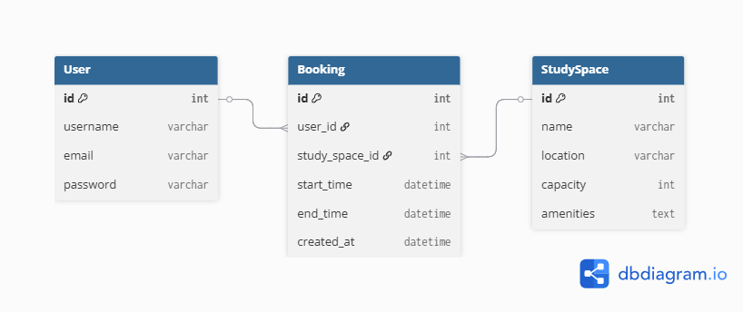

# backspace

## Entity Relationship Diagram (ERD) Design

### Description

The core of the study space booking system is based on three main entities: **User**, **StudySpace**, and **Booking**.  
- **User**: Represents a person who can book study spaces (using Django’s built-in User model).
- **StudySpace**: Represents a bookable room or area in the library.
- **Booking**: Represents a reservation made by a user for a specific study space and time.

Each booking links a user to a study space for a specific time period.  
A user can have many bookings, and a study space can have many bookings.

### Basic ERD Diagram

```
User --------< Booking >-------- StudySpace
```

- **User** (1) — (M) **Booking**
- **StudySpace** (1) — (M) **Booking**

This structure allows users to reserve available study spaces and manage their bookings efficiently.



credit: dbdiagram.io, https://dbdiagram.io/