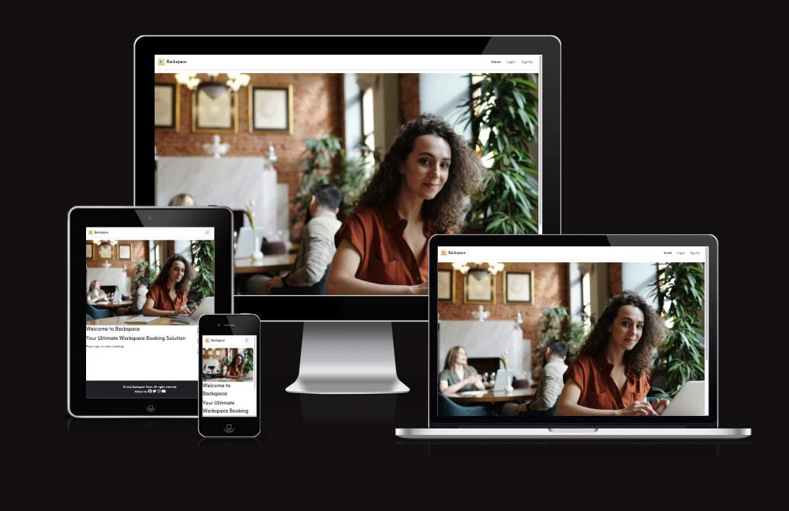
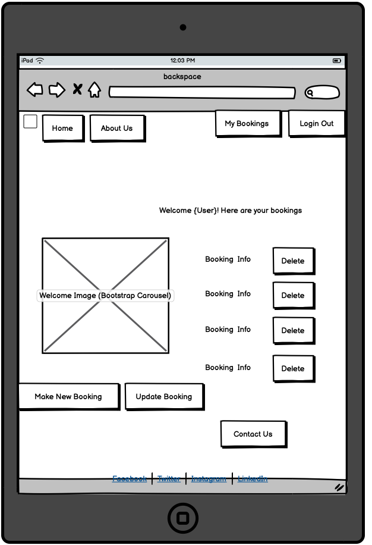
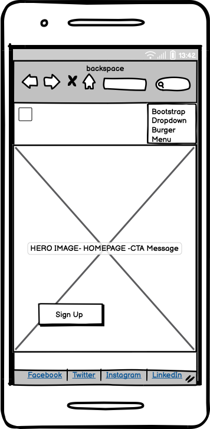
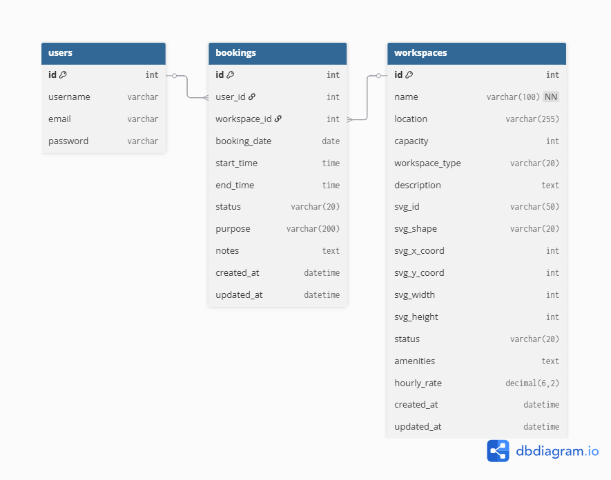
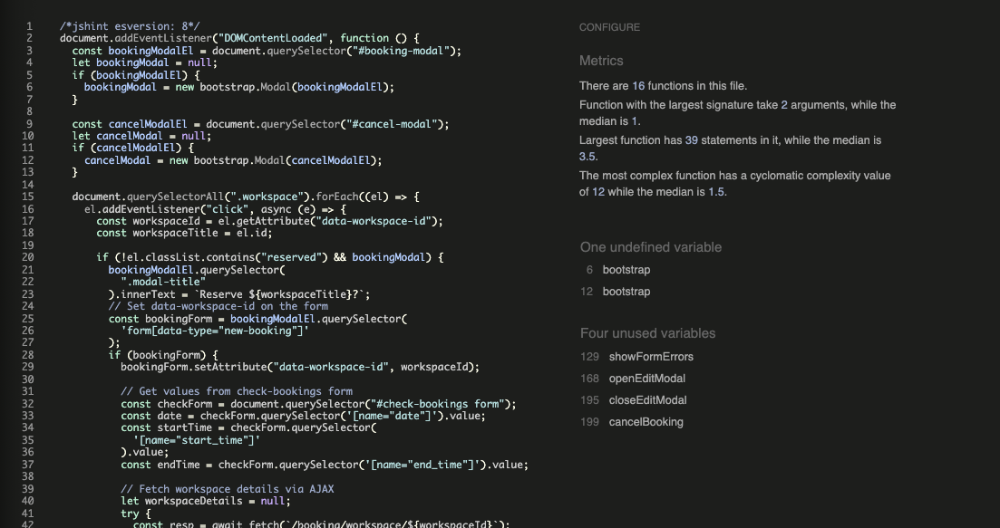
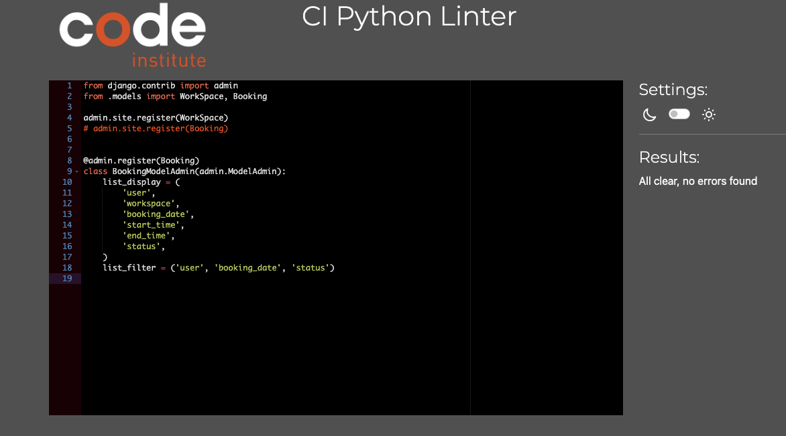
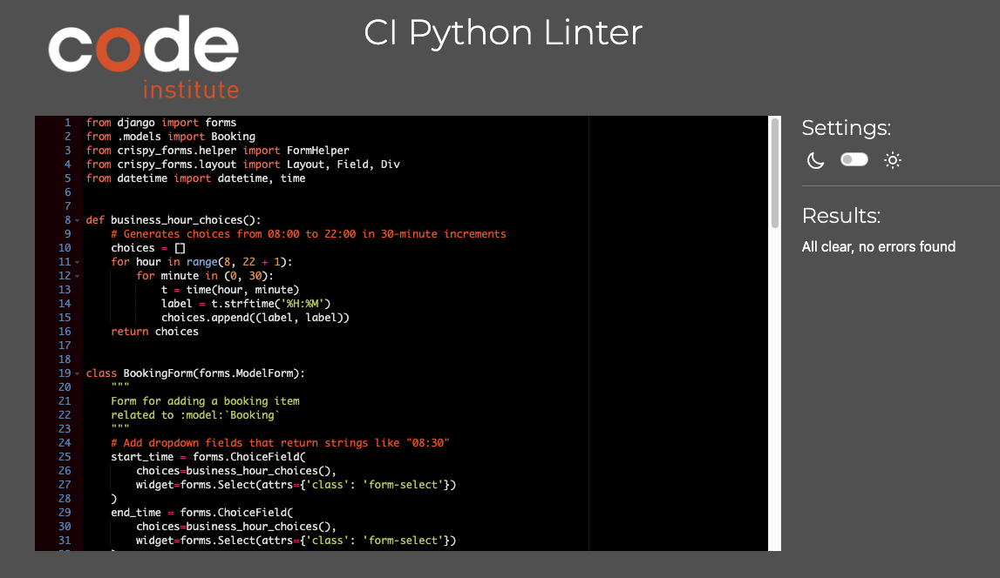
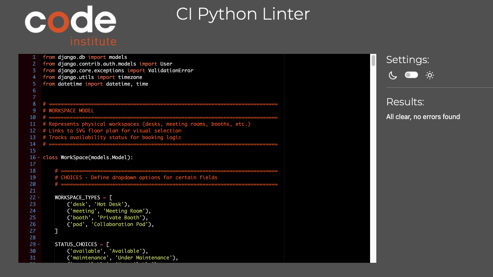
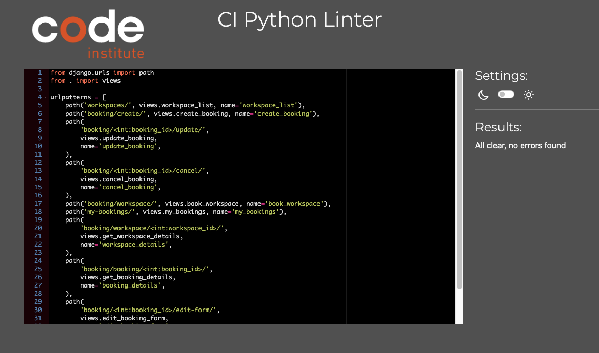

# backSPACE - Workspace Booking System

backSPACE is a Django-based workspace booking system that allows users to book desks, meeting rooms, and collaboration spaces in real-time. The application features an interactive SVG floor plan, CRUD operations for managing bookings, and an admin panel for workspace management.



[View Live Site](https://backspace-c8042b918673.herokuapp.com/) | [View GitHub Repository](https://github.com/sthDINESH/backspace)

---

## TABLE OF CONTENTS
1. [Design & Planning](#design--planning)
    * [User Experience (UX)](#user-experience-ux)
    * [User Stories](#user-stories)
    * [Wireframes](#wireframes)
    * [Typography](#typography)
    * [Colour Scheme](#colour-scheme)
    * [Entity Relationship Diagram (ERD)](#entity-relationship-diagram-erd-design)
    * [Database Schema](#database-schema)
    
2. [Features](#features)
    * [Existing Features](#existing-features)
    * [CRUD Operations](#crud-operations)
    * [Admin Panel](#admin-panel)
    * [Future Implementations](#future-implementations)
    * [Accessibility](#accessibility)

3. [Technologies Used](#technologies-used)
    * [Languages Used](#languages-used)
    * [Frameworks, Libraries & Programs Used](#frameworks-libraries--programs-used)

4. [Testing](#testing)
    * [Manual Testing](#manual-testing)
    * [Automated Testing](#automated-testing)
    * [Code Validation](#code-validation)

5. [Bugs](#bugs)

6. [Deployment](#deployment)
    * [Heroku Deployment](#heroku-deployment)
    * [Local Development](#local-development)

7. [Credits](#credits)
    * [Code Used](#code-used)
    * [Content](#content)
    * [AI Usage](#ai-usage)
    * [Acknowledgments](#acknowledgments)

---

## Design & Planning

### User Experience (UX)
The backSPACE booking system was designed with user convenience in mind. The application provides an intuitive interface for browsing available workspaces, making bookings, and managing reservations. The interactive floor plan allows users to visually select their preferred workspace, making the booking process straightforward and engaging.

**Target Audience:**
- Students and professionals needing workspaces
- Teams requiring meeting rooms
- Individuals seeking quiet study spaces

**User Goals:**
- Quickly find and book available workspaces
- View all personal bookings in one place
- Easily modify or cancel existing bookings
- See real-time workspace availability


### User Stories
User stories were created and tracked using GitHub Projects with MoSCoW prioritisation (Must Have, Should Have, Could Have, Won't Have) following Agile methodology.

#### Must Have (Critical - MVP Features)

**Epic 1: User Authentication & Authorisation**
- **US-001:** As a new visitor, I want to create an account with my email and password so that I can book workspace areas and manage my bookings
- **US-002:** As a registered user, I want to log in to my account so that I can access my bookings and make new reservations
- **US-003:** As a logged-in user, I want to log out of my account so that I can secure my account when using shared devices

**Epic 2: Workspace Visualisation & Selection**
- **US-004:** As a user, I want to see an interactive SVG floor plan of the workspace so that I can visually identify and select available spaces
- **US-005:** As a user, I want to click on an available space in the floor plan so that I can proceed to book it

**Epic 3: Booking Management (CRUD)**
- **US-006:** As a logged-in user, I want to book a selected workspace for a specific date and time so that I can reserve my workspace in advance
- **US-007:** As a logged-in user, I want to see a list of all my current and past bookings so that I can keep track of my workspace reservations
- **US-008:** As a logged-in user, I want to modify my existing booking (date, time, or workspace) so that I can adjust my plans if they change
- **US-009:** As a logged-in user, I want to cancel my booking so that I can free up the workspace if I no longer need it

**Epic 4: Core Data Models**
- **US-010:** As a developer, I want to design and implement a robust database schema so that the application can efficiently store and retrieve booking data

**Epic 5: Admin Panel**
- **US-011:** As an administrator, I want to add, edit, and remove workspace areas so that I can keep the floor plan up to date
- **US-012:** As an administrator, I want to view, edit, and cancel any user booking so that I can manage the workspace effectively

#### Should Have (Important but not Critical)

**Epic 6: Enhanced User Experience**
- **US-013:** As a user, I want to see real-time updates of workspace availability so that I don't attempt to book already-reserved spaces
- **US-014:** As a user, I want to know the deadline for modifying bookings so that I can plan accordingly
- **US-015:** As a user, I want to receive notifications when I create, edit, or cancel bookings so that I have confirmation of my actions
- **US-016:** As a user, I want to filter workspaces by type (desk, meeting room, booth) so that I can quickly find the right space for my needs
- **US-017:** As a logged-in user, I want to view and edit my profile information so that I can keep my details up to date

#### Could Have (Desirable)
- **US-018:** As a user, I want to view my complete booking history with pagination so that I can review past workspace usage
- **US-019:** As a user, I want to see amenities available at each workspace (WiFi, monitor, whiteboard) so that I can choose spaces that meet my needs
- **US-020:** As an administrator, I want to set minimum and maximum booking durations so that workspaces are used fairly
- **US-021:** As a user, I want to create recurring bookings (daily, weekly) so that I don't have to book the same space repeatedly

#### Won't Have (Future Considerations)
- **US-022:** Email notifications - Email confirmations and reminders for bookings
- **US-023:** Calendar Integration - Export bookings to Google Calendar/Outlook
- **US-024:** Payment Integration - Paid workspace bookings with Stripe
- **US-025:** Mobile App - Native iOS/Android application
- **US-026:** QR Code Check-in - QR codes for workspace check-in verification

[View Complete User Stories on GitHub Projects](https://github.com/users/sthDINESH/projects/10)


### Wireframes
Wireframes were created using Balsamiq to plan the layout and user flow before development.

**Desktop Wireframes:**
- Home page wireframe
- Floor plan view wireframe
- Booking list wireframe
- Booking form wireframe

**Mobile Wireframes:**
- Responsive layouts for all pages
- Mobile navigation design


Desktop:
 


Tablet:



Mobile:




### Typography


**Primary Font:** Lato
- Used for headings (h1, h2, h3)
- Modern, clean sans-serif typeface
- Weights used: 200 (Extra Light), 300 (Light), 400 (Regular), 700 (Bold), 800 (Extra Bold), 900 (Black)
- Italic variants: 300, 400
- Chosen for its contemporary appearance and excellent readability in headings

**Secondary Font:** Molengo
- Used for body text, paragraphs, and h4 headings
- Selected for legibility and comfortable reading experience
- Weight used: 400 (Regular)
- Applied to body, paragraphs, and secondary headings for content consistency

Both fonts are imported from Google Fonts to ensure consistent rendering across all browsers and devices.


### Colour Scheme
The colour scheme was chosen to create a professional, calming environment suitable for a workspace booking application, using a carefully curated palette of soft, welcoming colors.


**Primary Colours:**
- **Uranian Blue** `#b5e2faff` - Primary background color for navigation and main interface elements
- **Moonstone** `#0fa3b1ff` - Primary button color for call-to-action elements
- **Atomic Tangerine** `#f7a072ff` - Primary text color for emphasis and headings
- **Tiffany Blue** `#a6d8d4ff` - Highlight color for interactive elements

**Secondary Colours:**
- **Baby Powder** `#f9f7f3ff` - Secondary button color and light background elements
- **Vanilla** `#eddea4ff` - Secondary text color for subtle content
- **Red** `#ff0000` - Reserved/unavailable workspace indicator on floor plan

**Usage:**
- Navigation bar uses Uranian Blue background
- Headings (h1) use Atomic Tangerine for visibility
- Body text uses Molengo font with appropriate color contrast
- Interactive buttons use Moonstone for primary actions
- Reserved workspaces on SVG floor plan display in red

All colour combinations were tested to ensure readability and provide adequate contrast for accessibility.


### Entity Relationship Diagram (ERD) Design
The core of the study space booking system is based on three main entities: **User**, **WorkSpace**, and **Booking**.  
- **User**: Represents a person who can book study spaces (using Django’s built-in User model).
- **WorkSpace**: Represents a bookable room or area in the library.
- **Booking**: Represents a reservation made by a user for a specific study space and time.

Each booking links a user to a study space for a specific time period.  
A user can have many bookings, and a study space can have many bookings.


```
User --------< Booking >-------- WorkSpace
```

- **User** (1) — (M) **Booking**
- **WorkSpace** (1) — (M) **Booking**

This structure allows users to reserve available study spaces and manage their bookings efficiently.



credit: dbdiagram.io, https://dbdiagram.io/


### Database Schema
The database structure follows a relational model with three main entities:

```
User (Django built-in)
  ↓ (One-to-Many)
Booking
  ↓ (Many-to-One)
WorkSpace
```

**WorkSpace Model:**
- **Fields:** name, svg_id, svg_shape, svg_x_coord, svg_y_coord, svg_width, svg_height, status, location, capacity, workspace_type, description, amenities, hourly_rate, created_at, updated_at
- Stores information about bookable spaces (desks, meeting rooms, booths)
- Includes SVG coordinates for interactive floor plan positioning
- Tracks availability status (available, maintenance, reserved)

**Booking Model:**
- **Fields:** user (FK), workspace (FK), booking_date, start_time, end_time, status, purpose, notes, created_at, updated_at
- Represents user reservations with date and time slots
- Includes custom validation methods:
  - `clean()` - Validates business hours (8 AM - 10 PM), prevents past bookings, checks for overlapping reservations
  - `can_be_modified()` - Checks if booking is in the future and can be edited
  - `is_past()` - Determines if booking date/time has passed
- Status choices: pending, confirmed, cancelled, completed

**Relationships:**
- User → Booking: One-to-Many (one user can have multiple bookings)
- WorkSpace → Booking: One-to-Many (one workspace can have multiple bookings)

See the ERD diagram above for visual representation of the database structure.

---


## Features

### Existing Features


### CRUD Operations


### Admin Panel


### Future Implementations


### Accessibility


## Technologies Used

### Languages Used


### Frameworks, Libraries & Programs Used

## Testing

### Manual Testing


### Automated Testing


### Code Validation

#### CSS


#### HTML


#### LightHouse 

Mobile 


Desktop


#### Javascript


#### Python Lint





## Bugs

### Fixed Bugs


### Known Bugs


## Deployment

### Heroku Deployment


### Local Development

#### Forking the Repository


#### Cloning the Repository


#### Local Setup


## Credits

### Code Used


### Content


### AI Usage


### Media


### Acknowledgments


